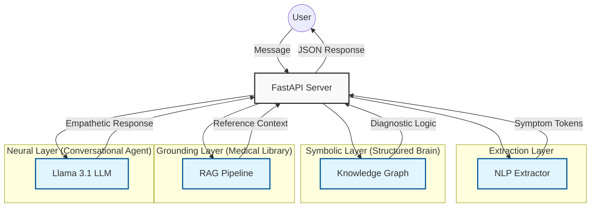

# 🏗️ System Architecture: SymptomAssist AI

SymptomAssist is built on a **Neuro-symbolic** architecture. It combines the structured reliability of Symbolic AI (Knowledge Graphs) with the conversational flexibility of Neural AI (Large Language Models).

---

## 1. High-Level Workflow
The following diagram illustrates how a user message travels through the system:

---

## 2. Component Breakdown

### 🧩 Symbolic Layer (`app/core/knowledge_graph.py`)
*   **Technology**: NetworkX (Directed Graph).
*   **Role**: Serves as the "Source of Truth" for medical logic.
*   **Logic**:
    *   **SUGGESTS Edges**: Map symptoms to conditions with weights.
    *   **CONFIRMED_BY Edges**: Map conditions to secondary symptoms (used for follow-up questions).
    *   **Red Flag Logic**: Immediate detection of emergency symptoms (e.g., chest pain, difficulty breathing) that override normal conversation.

### 🔍 Grounding Layer (`app/core/rag_pipeline.py`)
*   **Technology**: Sentence embeddings (`sentence-transformers`) + cosine similarity.
*   **Role**: Prevents LLM hallucinations by providing curated medical text.
*   **Process**:
    1.  **Indexing**: Medical fact sheets for each supported condition are embedded at startup.
    2.  **Retrieval**: The user's input is embedded and compared against the document vectors to find the most relevant documentation.
    3.  **Context Injection**: Snippets are injected into the LLM prompt so the AI "reads" the facts before speaking.

### ✂️ Extraction Layer (`app/core/nlp_extractor.py`)
*   **Technology**: Lexicon-based matching with Negation Detection.
*   **Role**: Converts messy human text into clean symptomatic tokens.
*   **Features**:
    *   **Synonym Mapping**: Maps "head is pounding" and "cephalgia" both to the `headache` symptom.
    *   **Negation Handling**: Recognizes "no fever" so that fever is not treated as a present symptom.

### 🗣️ Neural Layer (`app/main.py` & Groq)
*   **Technology**: Llama 3.1 (via Groq API).
*   **Role**: Handles the "conversation" logic.
*   **Function**:
    *   Summarizes findings with empathy.
    *   Asks follow-up questions in a natural way.
    *   Ensures the tone is professional yet accessible.

---

## 3. The "Neuro-symbolic" Advantage
Traditional AI chatbots often suffer from two extremes:
1.  **Rule-based bots**: Too rigid, fail on complex phrasing, feel robotic.
2.  **Pure LLM bots**: Prone to hallucinations, might miss critical red flags, inconsistent logic.

**SymptomAssist fixes this** by using the Knowledge Graph to "gatekeep" the LLM. The LLM is never allowed to "guess" a diagnosis; it can only discuss what the Symbolic Layer has validated and what the RAG Layer has documented.

---

## 4. API Endpoints
*   `POST /chat`: Primary orchestration endpoint.
*   `GET /graph-data`: Returns the full Knowledge Graph for frontend D3.js visualization.
*   `POST /debug/analyse`: Shows the internal extraction results (Symptoms, KG scores, RAG hits).
